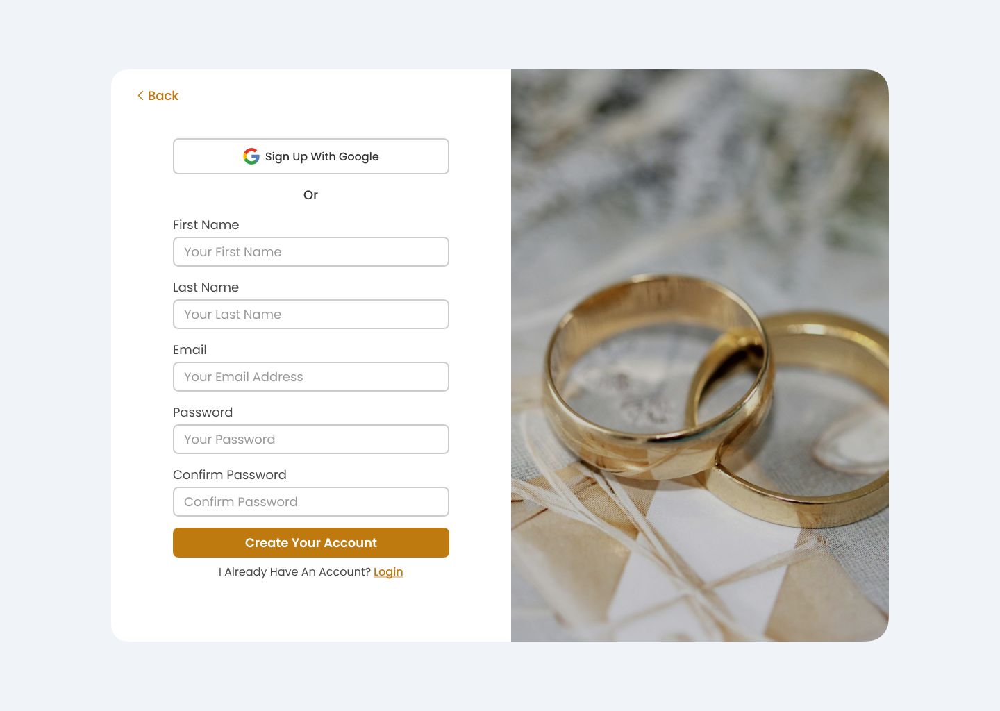
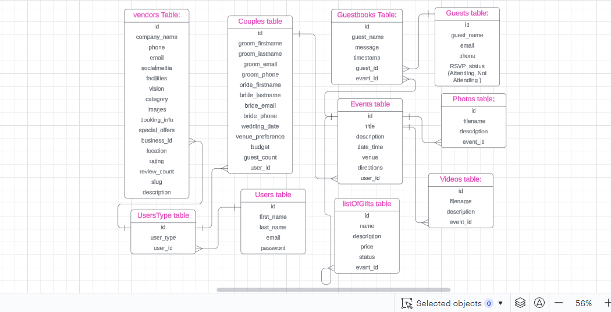

<br><br>

<!-- project philosophy -->


> A website that allows couples to book all their wedding details.
> 
> Couples can use the help of AI to get the best use of their budget.
> 3D demonstration to help couples envision how their dream day will look like.

### User Stories
#### Couples
- As a couple, we want to explore wedding themes and styles, so we can find inspiration for our dream wedding.
- As a couple, we want to customize our wedding package, so we can modify it to match our unique preferences and vision.
- As a couple, we want to manage our payments online, so we can easily keep track of our wedding expenses and avoid any inconveniences during the planning process.
#### Business Owners
- As a business owner, I want to list my wedding services on the website, so I can attract more clients.
- As a business owner, I want to manage my bookings and inquiries online, so I can keep my business organized.
- As a business owner, I want to receive reviews from clients, so I can build my reputation and improve my services.
#### Wedding Guests
- As a wedding guest, I want to view the couple's wedding website, so I can get all the details about the event.
- As a wedding guest, I want to RSVP to the wedding online, so I can confirm my attendance easily.
- As a wedding guest, I want to find the gift registry, so I can choose a gift that the couple will love.
#### Admin
- As an admin, I want to manage user accounts, so I can ensure the platform is being used appropriately.
- As an admin, I want to review new business listings, so I can maintain the quality of services offered on the platform.
- As an admin, I want to reply to users' emails, so I can provide support and assistance.

<br><br>
<!-- Tech stack -->


###  EverAfter Elegance is built using the following technologies:

- This project uses the GoLang programming language (https://golang.org/). GoLang is a statically typed, compiled programming language known for its simplicity and performance.
- For the frontend development, the project utilizes React.js (https://reactjs.org/), a popular JavaScript library for building user interfaces, combined with TypeScript (https://www.typescriptlang.org/) for type safety and improved developer experience.
- Tailwind CSS (https://tailwindcss.com/) is used for styling the application. Tailwind is a utility-first CSS framework that allows for rapid UI development with low-level utility classes.
- For persistent storage (database), the app uses MySQL (https://www.mysql.com/), a widely-used relational database management system that ensures reliable and efficient data management.
- To enhance user engagement, our website incorporates the cutting-edge OpenAI endpoint, leveraging the capabilities of the GPT-3.5-turbo model. This AI-driven feature provides users with intelligent and personalized assistance for wedding-related questions, offering support to couples and business owners alike.
- Our website offers a unique feature that provides 3D models showcasing vendors, allowing couples to visually explore and assess vendors' offerings before making their decisions.

<br><br>
<!-- UI UX -->


> We designed EverAfter Elegance using wireframes and mockups, iterating on the design until we reached the ideal layout for easy navigation and a seamless user experience.

- Project Figma design [figma](https://www.figma.com/design/MlNKZdeOmr4v8RdqBNgRz6/Final_Project?node-id=287-1361&t=PEn8rIBTbfvBI9z6-0)


### Mockups
| Home screen | SingleVendor Screen | WeddingInvitation Screen |
| ---| ---| ---|
|  |  |  |

<!-- |  |  |  |   -->
<br><br>

<!-- Database Design -->


###  Architecting Data Excellence: Pioneering Advanced Database Design Techniques:

- 


<br><br>


<!-- Implementation -->


### User Screens

  <tr>
    <th>Landing screen</th>
    <th>Landing screen</th>
    <th>Landing screen</th>
    <th>Landing screen</th>
    <th>Landing screen</th>
    <th>Login screen</th>
    <th>Register screen</th>
    <th>Vendors screen</th>
    <th>Single vendors screen</th>
    <th>Select business screen</th>
  </tr>
  <tr>
    <td></td>
    <td></td>
    <td></td>
    <td></td>
    <td></td>
    <td></td>
    <td></td>
    <td></td>
    <td></td>
    <td></td>
    <td></td>
  </tr>


<br><br>

### 3d Screens

[](https://www.youtube.com/watch?v=YOUR_VIDEO_ID_HERE)

   <!--  -->
<br><br>
<!-- Prompt Engineering -->


###  Mastering AI Interaction: Unlocking the Potential of Prompt Engineering:

- At EverAfter Elegance, we prioritize intelligent Prompt Engineering powered by OpenAI's cutting-edge natural language processing technology. This approach lies at the core of our commitment to delivering dynamic and contextually relevant interactions for our users.
- Our journey begins by engaging users with a tailored questionnaire designed to capture their preferences and requirements. As users interact with these questions, our system analyzes their responses to extract key phrases and words that are indicative of their needs.
- The extracted keywords serve as the foundation for our meticulously crafted prompts. By skillfully integrating these keywords, we ensure that our prompts are not only engaging but also highly relevant to each user's unique situation.

<br><br>

<!-- AWS Deployment -->


###  Efficient AI Deployment: Unleashing the Potential with AWS Integration:

#### The website is currently hosted on AWS infrastructure, ensuring reliability and scalability through services like EC2:
- install and configure mysql:
Installed mysql server on the instance and create a dedicated user for the application.
-  Install go runtime:
Installed go runtime necessary to run the backend project.
-  Install and configure nginx:
Installed and configured nginx as the reverse proxy listening at port 80 and proxying traffic to the backend running on port 8080


<br><br>

<!-- Unit Testing -->


###  Precision in Development: Harnessing the Power of Unit Testing:

- This project employs rigorous unit testing methodologies to ensure the reliability and accuracy of code components. By systematically evaluating individual units of the software, we guarantee a robust foundation, identifying and addressing potential issues early in the development process.

<br><br>


<!-- How to run -->


> To set up Ever After Elegance locally, follow these steps:

### Prerequisites

This is an example of how to list things you need to use the software and how to install them.
* npm
  ```sh
  npm install npm@latest -g
  ```

### Installation

_Below is an example of how you can instruct your audience on installing and setting up your app. This template doesn't rely on any external dependencies or services._

1. Get a free API Key at [example](https://example.com)
2. Clone the repo
   git clone [github](https://github.com/your_username_/Project-Name.git)
3. Install NPM packages
   ```sh
   npm install
   ```
4. Enter your API in `config.js`
   ```js
   const API_KEY = 'ENTER YOUR API';
   ```
5. npm run dev

Now, you should be able to run Ever After Elegance locally and explore its features.